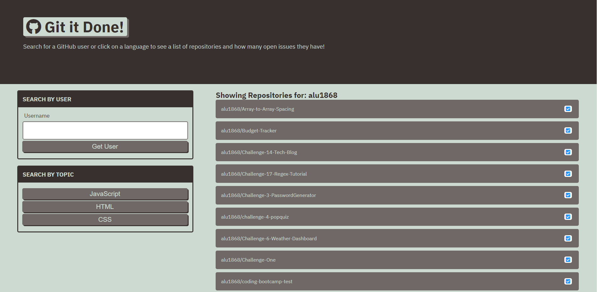

# Git-It-Done
An application to see a user's list of repositories on GitHub. Check for open and closed issues, and sort by language.

# Description

# Technologies
* HTML5
* CSS3
* JavaScript (ES2015 & ES6)
* Local Storage

# Links
* [Documentation for GitHub REST API](https://docs.github.com/en/rest?apiVersion=2022-11-28)
* [Deployed Link](https://alu1868.github.io/git-it-done/)
* [Author Link](https://github.com/alu1868)